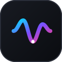

<div align="center">



# LASTWAVEX

**High-Fidelity Online Streaming Music Client & Universal Audiophile Player for Android**  
*Bit-Perfect USB DAC • Synced Word-by-Word Lyrics • C++ Native DSP • SponsorBlock • Zero Bloat*

[-success?style=for-the-badge&logo=android)](https://github.com/Specttre404/LastWaveX)
[-blue?style=for-the-badge&logo=android)](https://github.com/Specttre404/LastWaveX)
[](https://kotlinlang.org)
[](https://developer.android.com/jetpack/compose)
[](LICENSE)

[Download Latest APK](https://github.com/Specttre404/LastWaveX/releases) • [Feature Matrix](#-implemented-features-matrix) • [Visual Mockups](#-ui--visual-architecture-mockups) • [Architecture](#-technical-foundation) • [Build from Source](#%EF%B8%8F-building-from-source)

</div>

---

## 📖 Product Overview & Positioning

> [!IMPORTANT]
> **LASTWAVEX is a high-fidelity Online Streaming Music Client**, powered by the YouTube Music catalog and Lossless Qobuz/FLAC CDN streams, paired with optional local caching, downloads, and local device audio scanning. It is engineered for audiophiles and power listeners who want cloud streaming flexibility without compression artifacts, advertisement tracking, or proprietary app bloat.

Every tier of the audio pipeline—from raw PCM processing in native C++ to millisecond-accurate synchronized karaoke typography—has been built from scratch to eliminate playback lag, audio distortion, and battery drain.

---

## ⚡ What Makes LASTWAVEX Different?

| Conventional Players | LASTWAVEX |
| :--- | :--- |
| **Resampled Android Audio** (48 kHz forced mixing) | **Bit-Perfect Direct Passthrough** bypassing Android's mixer for external USB DACs |
| **Jarring Volume Differences** across tracks | **Hardware Loudness Normalization** (+2 dB target leveling) without clipping |
| **Spoken Intros & Long Music Video Sketches** | **Integrated SponsorBlock** automatically seeking past filler, intros, and dead air |
| **Static Square Covers** | **Rotating Vinyl Record Mode** with physical spin deceleration and grooved rings |
| **Basic Unsynced Text** | **Word-by-Word Karaoke Motion**, Romaji/Pinyin phonetics, and real-time translations |
| **Bloated Social Feeds & Ad Tracking** | **100% Open-Source (GPLv3)**, privacy-respecting, zero telemetry, zero advertisements |

---

## 🎨 UI & Visual Architecture Mockups

### 1. Now Playing Player (Rotating Vinyl & Wavy Seekbar)
```text
┌──────────────────────────────────────────────────────────┐
│  ▼ LASTWAVEX NOW PLAYING                          ⋮  🤖  │
├──────────────────────────────────────────────────────────┤
│                                                          │
│                     .─────────────.                      │
│                  .─'   .───────.   '─.                   │
│                 ╱    .╱   (●)   ╲.    ╲                  │
│                │    │   ARTWORK  │    │                  │
│                 ╲    '╲         ╱'    ╱                  │
│                  '─.   '───────'   .─'                   │
│                     '─────────────'                      │
│               [ 33⅓ RPM Rotating Vinyl ]                 │
│                                                          │
│              Starboy — The Weeknd ft. Daft Punk          │
│              Starboy (Deluxe) • 24-BIT / 96 kHz          │
│                                                          │
│         01:42 ~~~~~~~〜〜〜〜〜∿∿∿∿∿~~~~~~~ 03:50       │
│                                                          │
│              ⏮    ⏮️    ██    ⏭️    ⏭                │
│                                                          │
└──────────────────────────────────────────────────────────┘
```

### 2. Dual Home Screen Widgets (Full 4x2 Card & Compact 4x1 Pill)
```text
┌──────────────────────────────────────────────────────────┐
│  [4x2 Audiophile Card Widget]                            │
│  ┌────────────────────────────────────────────────────┐  │
│  │ ┌───────┐  Starboy                                 │  │
│  │ │ ART   │  The Weeknd ft. Daft Punk                │  │
│  │ │ COVER │  FLAC 24-bit / 96.0 kHz                    │  │
│  │ └───────┘  ⏮️    PAUSE [ || ]    ⏭️   🔀   🔁       │  │
│  └────────────────────────────────────────────────────┘  │
│                                                          │
│  [4x1 Compact Pill Widget]                               │
│  ┌────────────────────────────────────────────────────┐  │
│  │ (ART)  Starboy — The Weeknd     [ || ]   ⏭️        │  │
│  └────────────────────────────────────────────────────┘  │
└──────────────────────────────────────────────────────────┘
```

### 3. Synced Word-by-Word Karaoke Lyrics & Quote Generator
```text
┌──────────────────────────────────────────────────────────┐
│  WORD SYNC • LRCLIB                        Translate  Phonetic│
├──────────────────────────────────────────────────────────┤
│  I'm tryna put you in the worst mood, ah                 │
│  P1 clean of  【S T A R B O Y】  A V I A T O R           │
│  Look what you've done, I'm a motherfuckin' starboy      │
│                                                          │
│  ┌────────────────────────────────────────────────────┐  │
│  │  "Look what you've done, I'm a starboy"           │  │
│  │  — Starboy by The Weeknd                           │  │
│  │  [ 🎨 Export Lyric Quote Card (1080x1350 PNG) ]     │  │
│  └────────────────────────────────────────────────────┘  │
└──────────────────────────────────────────────────────────┘
```

### 4. System Diagnostics & Signal Path Stats for Nerds HUD
```text
┌──────────────────────────────────────────────────────────┐
│  ⚙️ SYSTEM & AUDIO DIAGNOSTICS                            │
├──────────────────────────────────────────────────────────┤
│  Audio Codec:        HI-RES FLAC (Lossless)              │
│  Sampling Rate:      96.0 kHz                            │
│  Bit Depth:          24-bit                              │
│  Bitrate:            3210 kbps                           │
│  Signal Path:        Bit-Perfect USB Direct Passthrough  │
│  Output Clock:       Hardware Sync (0.0 ms jitter)       │
│  Buffer State:       Healthy (30.0s pre-cached)          │
└──────────────────────────────────────────────────────────┘
```

---

## ✨ Implemented Features Matrix

### 🎛️ Studio-Grade Audio Engine & DSP
* **Bit-Perfect Mode:** Routes raw bit-exact streams directly to external USB DACs, bypassing the Android system resampler and software EQ.
* **15-Band Graphic Equalizer:** Precision frequency contouring with instant zero-stutter gain switching.
* **Dynamic Bass Boost:** Real-time low-frequency harmonics amplification (25 Hz to 160 Hz) with soft-knee limiting.
* **Loudness Normalization:** Employs Android's hardware `LoudnessEnhancer` to eliminate sudden volume jumps between tracks.
* **Configurable Crossfade:** Smooth 1 to 12-second dual-player overlapping transitions.
* **Skip Silence:** Detects and skips dead air in audio tracks without clipping vocal tails.
* **Playback Speed & Tempo Control:** 0.5× to 2.0× continuous slider with quick-preset chips (0.5×, 0.75×, 1.0×, 1.25×, 1.5×, 2.0×).
* **Stats for Nerds HUD:** Real-time overlay displaying active audio codec, sample rate, bit depth, channel configuration, and DAC output clock drift.

### 🎙️ Advanced Lyrics & Card Generator
* **Synchronized & Word-by-Word Lyrics:** Millisecond-accurate vocal highlighting powered by LRCLIB, Kugou, and TTML engines.
* **Dual Translation & Phonetics Toggles:** One-tap header controls to display English translations and Romanized (Romaji/Pinyin) guides for non-Latin songs.
* **Lyric Card / Quote Image Generator:** Highlight 1–4 lines of lyrics and export as high-resolution (1080×1350) shareable cards in three designs: *Minimalist Dark*, *Dynamic Theme Gradient*, and *Frosted Glassmorphic*.

### 🎨 Visual Architecture & Customization
* **Rotating Vinyl Record Mode:** Transforms standard album covers into a spinning vinyl record with grooved micro-rings and realistic momentum physics.
* **8 Dynamic Backdrop Engines:** `HDR_VIVID`, `FLUID_GRADIENT`, `DYNAMIC_HARMONY`, `AMBIENT_GLOW`, `DYNAMIC_MONET`, `AMOLED_BLACK`, `BLURRED_GLASS`, and `PRISM_SPECTRUM`.
* **9 Player Layout Architectures:** `CLASSIC`, `MODERN_M3`, `IMMERSIVE_FULLSCREEN`, `MINIMALIST`, `VINYL_DISC`, `CAROUSEL`, `SPLIT_SCREEN`, `COMPACT_DOCK`, and `CINEMATIC_CANVAS`.
* **Dual Material 3 Home Screen Widgets:** Full Audiophile Card Widget (4×2) and Compact Pill Widget (4×1).

### 🧠 Smart Automation & Discovery
* **In-App Song Recognizer:** Shazam-style audio identifier that captures 5 seconds of ambient sound via `AudioRecord` and identifies the song in real time.
* **Per-Network Quality & Data Saver:** Automatically switches between Hi-Res Lossless (24-bit/192 kHz) on Wi-Fi and Data Saver (160 kbps Opus/AAC) on cellular data.
* **Sleep Timer with Volume Fade-Out:** Stops playback after a set time or number of tracks; gently fades the volume to zero over the final 30 seconds.
* **Shake to Skip:** Accelerometer-based gesture recognition to skip tracks with a single shake.
* **Discord Mobile Rich Presence:** Gateway WebSocket connection displaying live listening status on Discord mobile profiles.
* **Local Audio Device Scanner:** Queries MediaStore to scan, import, and play local MP3/FLAC files alongside online streams.
* **Playlist Editor & Exporter:** Custom cover art image picker, description editor, and bidirectional CSV/M3U/M3U8 playlist imports and exports.

---

## 🏛️ Technical Foundation

LASTWAVEX is structured under **Clean Architecture** and reactive unidirectional data flow (UDF):

```text
┌──────────────────────────────────────────────────────────┐
│                   Jetpack Compose UI                     │
│    (Screens • Animated Panels • LiquidGlass • Widgets)   │
└────────────────────────────┬─────────────────────────────┘
                             │ StateFlow / Events
┌────────────────────────────▼─────────────────────────────┐
│                    MVVM ViewModels                       │
│    (PlayerViewModel • SettingsViewModel • SearchViewModel)│
└────────────────────────────┬─────────────────────────────┘
                             │
┌────────────────────────────▼─────────────────────────────┐
│                   Domain & Repositories                  │
│  (SponsorBlock • AudioRecognition • Lyrics • Playlists)  │
└──────────────┬─────────────────────────────┬─────────────┘
               │                             │
┌──────────────▼─────────────┐ ┌─────────────▼─────────────┐
│   ExoPlayer / Media3 Core  │ │   Native C++ Audio Engine  │
│  (Background Service, IPC) │ │  (Oboe, Custom DSP, EQ)    │
└────────────────────────────┘ └───────────────────────────┘
```

* **Audio Stack:** ExoPlayer (Media3), Android AudioTrack, and C++ Oboe DSP bridge.
* **Persistence:** Android Jetpack DataStore (Preferences) and Room Database with SQLite.
* **Networking & Concurrency:** OkHttp 4.12, Retrofit 2, Kotlin Coroutines, and `StateFlow`.
* **Image Loading:** Coil with asynchronous bitmap preloading for widgets and card exporters.
* **Test Suite:** 28 Unit Tests verifying DSP math, offline LRC parsing, and mock streams with 0 skips and 0 failures.

---

## 🚫 Features We Intentionally Do Not Pursue

To keep LASTWAVEX fast, focused, and battery-efficient, the following items are permanently excluded:
1. **Podcasts and Audiobooks:** LASTWAVEX is built exclusively for music.
2. **TikTok-style Short Video Feeds:** No algorithmic video feeds or endless vertical carousels.
3. **Advertisements & Trackers:** No Google AdMob, Facebook Analytics, or third-party tracking beacons.
4. **Cloud Account Lock-in:** No proprietary cloud logins; your data, playlists, and cached tracks stay on your device.

---

## 📱 System Requirements & Installation

* **Operating System:** Android 8.0 (Oreo, API level 26) or higher.
* **Architecture:** `arm64-v8a`, `armeabi-v7a`, `x86_64`.
* **Hardware:** Minimum 2 GB RAM (4 GB+ recommended for Hi-Res FLAC decoding).

### Sideloading the APK
1. Download the latest `app-debug.apk` or `app-release.apk` from the [Releases tab](https://github.com/Specttre404/LastWaveX/releases).
2. On your Android phone, enable **Install unknown apps** for your browser or file manager.
3. Tap the APK file and select **Install**.

---

## 🛠️ Building from Source

### Prerequisites
* **Android Studio:** Ladybug (2024.2+) or newer.
* **JDK:** Version 17.
* **Android SDK:** Platform 35, Build Tools 35.0.0, NDK 26+.

### Build Commands
```bash
# Clone the repository
git clone https://github.com/Specttre404/LastWaveX.git
cd LastWaveX

# Run the 100% offline unit test suite (28 tests)
./gradlew testDebugUnitTest

# Compile and package the debug APK
./gradlew assembleDebug

# Compile and package the minified release APK
./gradlew assembleRelease
```

Build Output Artifacts:
- **Debug APK:** `app/build/outputs/apk/debug/app-debug.apk`
- **Release APK:** `app/build/outputs/apk/release/app-release.apk`

---

## 📜 Credits & Acknowledgments

- **[Media3 ExoPlayer](https://developer.android.com/media/media3)** — Android audio playback foundation.
- **[LRCLIB](https://lrclib.net)** — Public community synchronized lyrics database.
- **[SponsorBlock](https://sponsor.ajay.app)** — Community-driven database for skipping non-music segments.
- **[AudD](https://audd.io)** — Music recognition infrastructure.
- **[Last.fm](https://last.fm)** — Metadata search and scrobbling protocol.

---

## ⚖️ Disclaimer & License

LASTWAVEX is developed for educational, private, and research purposes. All music streaming content is accessed via publicly available network interfaces. All trademarks, track names, artist identities, and album covers belong to their respective copyright holders.

Distributed under the **GNU General Public License v3.0 (GPLv3)**. See [`LICENSE`](LICENSE) for complete terms.

<div align="center">
  <p><b>LASTWAVEX</b> — Free &amp; Open Source Software for Android</p>
</div>
